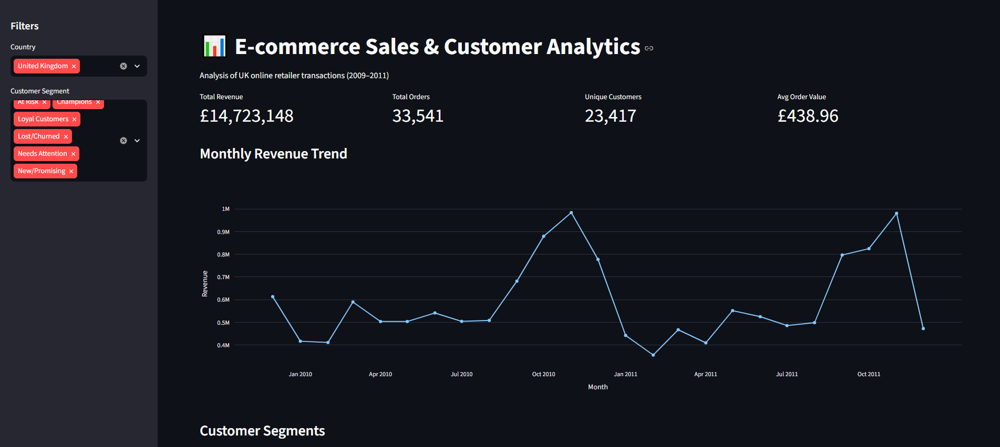
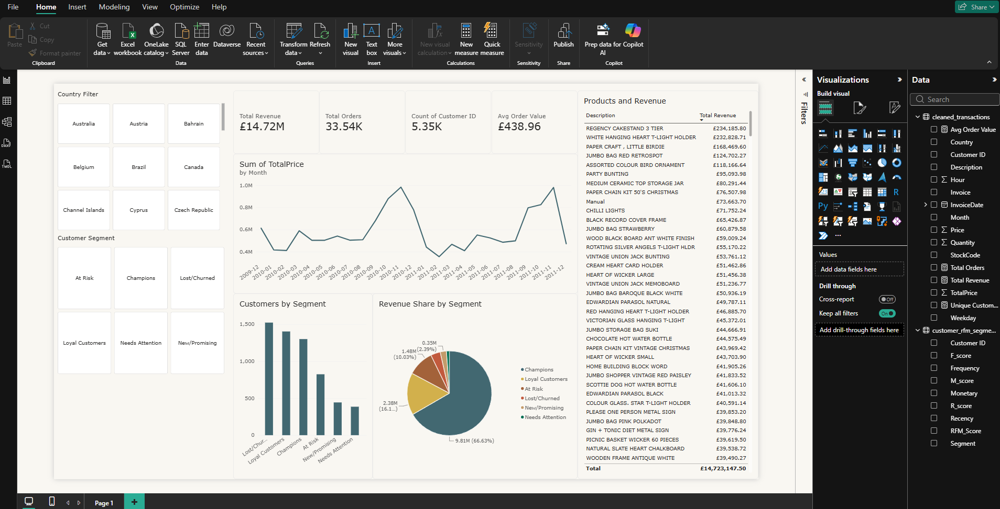

# Online Retail II UCI - E-commerce Sales & Customer Analytics

Customer segmentation and sales analysis on a UK-based online retailer's transaction data (2009–2011), using **Python** for data cleaning/EDA/RFM segmentation, **Streamlit** for an interactive live dashboard, and **Power BI** for a business-facing report.

**[🚀 Live Streamlit Dashboard](https://online-retail-ii-uci-analysis-2cd4mzjy87cvxuxzmjpjpj.streamlit.app/)**

**[📈 Power BI Report (related csv and .pbix in Drive)](https://drive.google.com/drive/folders/1arRNyOyowNGdqR4bF7yZi04QH3MVNqpd?usp=sharing)**

---

## Overview

This project analyzes ~1M+ raw transactions from a UK online retailer to answer three core business questions:

1. What does the sales trend look like over time, and when do customers shop most?
2. Which products and countries drive the most revenue?
3. Who are the most valuable customers, and which ones are at risk of churning?

The analysis pipeline was built in Python, then extended into two dashboard formats — a public interactive **Streamlit** web app, and a polished **Power BI** report for business-style reporting.

---

## Key Insight

Using RFM (Recency, Frequency, Monetary) segmentation, customers were split into 6 segments. The standout finding:

> **Champions make up just 22% of the customer base but drive 68.4% of total revenue** — a clear Pareto pattern that highlights where retention efforts should be focused.

| Segment | Customers | % of Revenue |
|---|---|---|
| Champions | 1,300 (22%) | 68.4% |
| Loyal Customers | 1,403 (24%) | 15.3% |
| At Risk | 824 (14%) | 9.2% |
| Lost/Churned | 1,523 (26%) | 3.8% |
| New/Promising | 443 (8%) | 2.2% |
| Needs Attention | 385 (6%) | 1.2% |

---

## Dataset

**[Online Retail II UCI — Kaggle](https://www.kaggle.com/datasets/mashlyn/online-retail-ii-uci)**
1,067,371 transactions from a UK-based online retailer, Dec 2009–Dec 2011. Not included in this repo due to size — download from Kaggle and place as `online_retail_II.csv` in the root directory to reproduce the analysis.

---

## Process

### 1. Data Cleaning
- Removed ~242K rows with missing `Customer ID` (can't attribute to a customer)
- Separated ~18.7K cancelled orders (`Invoice` starting with `'C'`) into a returns table
- Filtered out zero/negative price and quantity rows
- Result: **805,549 clean transaction rows**, zero nulls

### 2. Exploratory Data Analysis
- Monthly revenue trend (clear pre-Christmas seasonal spike each November)
- Peak order times: Thursdays, and 12:00–13:00 (lunch-hour shopping)
- No Saturday orders — a known quirk of this dataset (store closed for orders that day)
- Top products and revenue by country

### 3. RFM Customer Segmentation
- Calculated Recency, Frequency, and Monetary value per customer
- Scored each dimension into quintiles (1–5) and combined into 6 business-readable segments: Champions, Loyal Customers, At Risk, Lost/Churned, New/Promising, Needs Attention

### 4. Dashboards
- **Streamlit**: interactive filters by country and segment, live KPIs, revenue trend, segment breakdown, top products
- **Power BI**: DAX measures (`Total Revenue`, `Avg Order Value`, `Unique Customers`) built from the same cleaned dataset, with country slicer and monthly trend visual

---

## Repo Structure

```
├── app.py                          # Streamlit dashboard
├── data.ipynb                      # Full analysis notebook (cleaning → EDA → RFM)
├── requirements.txt                # Python dependencies
├── customer_rfm_segments.csv       # Customer-level RFM scores + segment labels
├── country_monthly_summary.csv     # Revenue/orders aggregated by country + month
├── country_customers_summary.csv   # Unique customer counts by country
├── product_country_summary.csv     # Product revenue broken down by country
├── monthly_summary.csv             # Revenue/orders/customers aggregated by month
├── streamlitpage1.png              # Streamlit dashboard screenshot
├── powerbipage1.png                # Power BI report screenshot
└── online_retail_II.csv            # Raw source data (not tracked — download from Kaggle)
```

> Note: `cleaned_transactions.csv` and `online_retail_II.csv` are excluded from version control (`.gitignore`) due to file size. All dashboard visuals run off small pre-aggregated summary tables instead.

---

## Tech Stack

- **Python**: pandas, matplotlib, seaborn
- **Streamlit + Plotly**: interactive web dashboard
- **Power BI**: DAX measures, slicers, business reporting
- **Deployment**: Streamlit Community Cloud

---

## Run Locally

```bash
git clone https://github.com/asymihoney/Online-Retail-II-UCI-Analysis
cd online-retail-ii-uci-analysis
pip install -r requirements.txt
streamlit run app.py
```

To reproduce the full analysis from raw data, download the dataset from Kaggle, place it as `online_retail_II.csv` in the root folder, and run `data.ipynb` top to bottom.

---

## Screenshots

**Streamlit Dashboard**


**Power BI Report**
